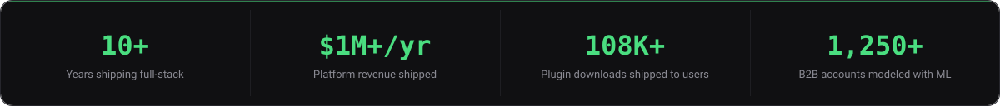

  

  
  
  
  

  

 

## ▍The short version

I build the systems companies actually run on — then I make them smarter.

Ten-plus years of enterprise .NET, React, and cloud-native architecture, with the unusual habit of owning things **end to end**: SQL schema, domain model, API, front end, pipeline, deploy. I've been the sole developer on a platform grossing **$1M+/year**, the architect of an **ML churn-prediction system** covering 1,250+ B2B accounts, and the person who wires CRM, ERP, PIM, commerce, and identity together when there's no integration path between them.

These days my focus is **applied AI** — not demos, but production: ML-powered analytics, agentic workflows, and AI-driven data pipelines that ship and stay up.

 

## ▍What I'm actually good at

<table>
<tr>
<td width="33%" valign="top">

**🏗️ Architecture that survives**

Microservices, event-driven, vertical slice, DDD. Duende IdentityServer, MassTransit + RabbitMQ, gRPC, Azure Service Bus. I make the framework-upgrade and system-design calls, and I defend them to IT leadership.

</td>
<td width="33%" valign="top">

**🤖 AI that reaches production**

RFM segmentation and churn models over 1,250+ accounts. AI-driven ETL in .NET 8. Agentic engineering workflows. I've shipped ML that changes business decisions, not slide decks.

</td>
<td width="33%" valign="top">

**🔌 Integration nobody else wants**

ERP ↔ CRM ↔ PIM ↔ commerce ↔ identity. Multi-currency payments with fraud detection. Azure Functions over Service Bus for real-time sync. The unglamorous plumbing that makes the rest possible.

</td>
</tr>
</table>

 

## ▍Where I've done it

**🟢 Senior Full-Stack Software Engineer** · **OneDigital** · *Apr 2026 — Present*

Primary technical owner of the corporate website and digital platforms at a national benefits, HR, and financial services company. I architect and build complex apps end to end in .NET, C#, React (Redux/Next.js), and SQL Server; own the GitHub Actions / Azure CI/CD pipelines; drive framework-upgrade and system-design decisions alongside IT Leadership; and translate between Marketing and IT so business needs turn into real technical trade-offs.

<b>▸ Previous roles &mdash; the receipts</b>

 

**Software Engineer II** · **Crisis Prevention Institute** · *Nov 2024 — Apr 2026* · Milwaukee, WI
- Led full-stack development of an enterprise e-commerce platform on .NET 8, ASP.NET Core, and Optimizely CMS/Commerce 14+.
- Built **Orderly** from scratch — an ML analytics platform with RFM segmentation and churn prediction across **1,250+ B2B accounts**.
- Migrated payments to PayFabric/Cybersource with multi-currency (US/CA) support and fraud detection.
- Developed Azure Functions microservices over Service Bus for real-time data sync.
- Founded and led a joint Product Development & Engineering committee; contributed to **Project Golden Eye**, an agentic AI initiative for engineers.

**System Engineer (SaaS)** · **Ellsworth Adhesives** · *Jan 2023 — Nov 2024*
> Primary tech lead and developer for the marketing department at a global specialty-chemical distributor spanning **21 countries and 20+ facilities**.
- Built back-end solutions in .NET, PHP, Python, and TypeScript for large-scale applications.
- Developed **AI-powered data pipelines** with .NET 8.
- Built BFF (Backend-for-Frontend) layers with React, Vue.js, and Next.js.
- Automated data sync across ERP, CRM, PIM, and website; managed Optimizely CMS & Commerce.

**Web & Software Developer** · **Independent Consultant** · *Feb 2016 — Jan 2023*
- Sole developer of a medical-book e-commerce platform grossing **$1M+/year**.
- Maintained 10 WordPress.org plugins — **108,000+ lifetime downloads, 8,000 active users**.
- Engineered high-traffic e-commerce sites; led legacy-to-modern framework transitions.
- WordCamp speaker and active WordPress community contributor.

**Web Developer** · **Orion Group** · *Jul 2014 — Feb 2016*
- Lead developer of a geographical CMS (GeoCMS) overlaying the Ice Age Trail on Google Maps with user-submitted stories and map pins.
- Developed custom WordPress themes and plugins.

 

## ▍Featured work

<table>
<tr>
<td width="50%" valign="top">

### [AuctionNext](https://github.com/amg262/AuctionNext) `⭐ 18`

A complete microservices auction platform — not a toy. SSO, real payments, message-driven services, and full observability.

`Next.js` `.NET 8` `Duende IdentityServer` `MassTransit` `RabbitMQ` `gRPC` `Stripe` `Redis` `OpenTelemetry` `Grafana` `Docker` `Kubernetes`

</td>
<td width="50%" valign="top">

### Orderly `1,250+ accounts`

ML-powered customer analytics built from zero: RFM segmentation, churn-prediction models, and real-time BI dashboards that changed how a business talks to its customers.

`.NET` `Machine Learning` `RFM` `Churn Prediction` `BI`

</td>
</tr>
<tr>
<td width="50%" valign="top">

### [DataBridge](https://github.com/amg262/DataBridge)

Integration platform for systems with no integration path. Scheduled retrieval, ETL, and AI analysis — the connector of last resort.

`.NET 8` `ETL` `AI` `Job Scheduling`

</td>
<td width="50%" valign="top">

### [Lattice](https://github.com/amg262/lattice)

Real-time, self-hosted network monitoring with a Palantir-style dark UI — live device topology, traffic flows, bandwidth timelines, protocol distribution.

`Python` `Real-time` `Dashboards` `Self-hosted`

</td>
</tr>
<tr>
<td width="50%" valign="top">

### [SecureApiKeys](https://github.com/amg262/SecureApiKeys)

Production-ready .NET library for cryptographically secure API key generation with customizable formatting. Security best practices, shipped as a package.

`C#` `NuGet` `Cryptography` `Security`

</td>
<td width="50%" valign="top">

### [WordPress Plugins](https://wordpress.org/plugins/search/andrew+gunn/) `108K+ downloads`

10 published plugins, 8,000 active users — including a WooCommerce Bill of Materials plugin handling parts, assemblies, and sub-assemblies.

`PHP` `WooCommerce` `WordPress` `Open Source`

</td>
</tr>
</table>

 

## ▍Tech arsenal

<b>LANGUAGES</b> 

<b>BACKEND &amp; DATA</b> 

<b>FRONTEND</b> 

<b>CLOUD &amp; DEVOPS</b> 

  
  
  
  
  
  
  
  

  <b>Architecture:</b> Microservices · Vertical Slice · Event-Driven · DDD · TDD · BFF

 

## ▍By the numbers

  
  

  

 

## ▍Off the clock

- 🎤 **WordCamp speaker** and long-time WordPress community contributor
- 🧪 Founded and led a joint **Product Development & Engineering committee** at CPI
- 🎓 **Waukesha County Technical College** — Web & Software Development · GPA 3.80 · Phi Theta Kappa · Machine Learning Lab · Dr. Richard T. Anderson Scholarship
- 🏠 Home lab: Pi-hole, Docker home automation, and a self-hosted network monitor I built because the commercial ones annoyed me

 

---

  <b>Got a system that needs building — or one that needs rescuing?</b> 
  I'm most useful on hard integration problems, enterprise .NET architecture, and getting AI from prototype to production.

  
  

  <code>❯ Always Be Claudemaxxing.</code>

